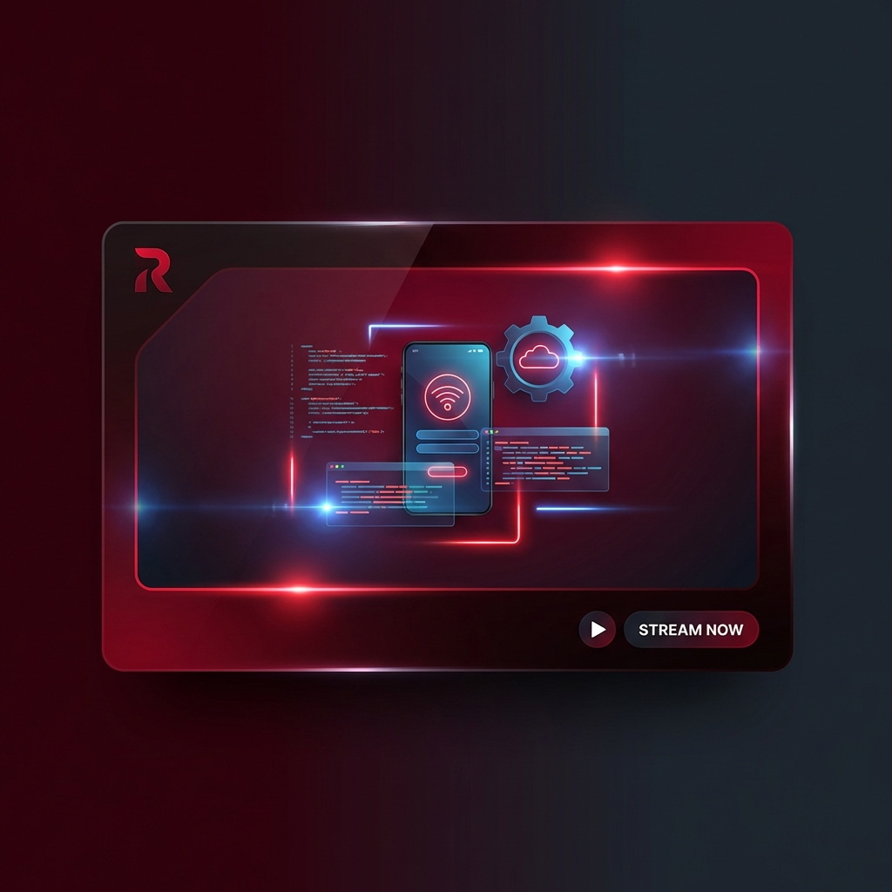

# 🦈 RedPro Bio - Linktree Estilo Netflix

Uma página de links premium no estilo Netflix, com visual cinematográfico, animações suaves e rastreamento de analytics.



## ✨ Features

- 🎬 **Visual Netflix** - Cards com hover cinematográfico e efeitos neon
- 🖼️ **Modal de Detalhes** - Janela elegante com mais informações antes de redirecionar
- 📱 **Responsivo** - Perfeito em qualquer dispositivo
- 🎨 **Design Premium** - Cores Netflix + degradês neon vermelho→azul
- 🔍 **SEO Otimizado** - Meta tags, Open Graph, Twitter Cards
- 📊 **Analytics Ready** - Preparado para rastreamento (Fase 02)
- 🎯 **Pixels Ready** - Placeholders para Meta, GA4 e TikTok (Fase 03)

## 🚀 Stack

- **Frontend:** HTML5, CSS3, JavaScript Vanilla
- **Backend:** Supabase (em implementação)
- **Deploy:** Vercel (em implementação)

## 📁 Estrutura

```
link_bio_tree/
├── index.html          # Página principal
├── css/
│   └── styles.css      # Estilos Netflix + neon
├── js/
│   └── app.js          # Lógica de interatividade
├── images/             # Thumbnails dos cards
├── docs/               # Documentação
│   ├── asbuilt.md      # Roadmap e status
│   └── plano-tarefas.md
└── README.md
```

## 🎯 Cards Disponíveis

| Card | Descrição | URL |
|------|-----------|-----|
| Redflix | Projetos prontos para vender | redflix.redpro.com.br |
| Contrate um Shark | Contrate desenvolvedores | contrateumshark.redpro.com.br |
| Método Shark | Curso Vibe Coding | metodoshark.redpro.com.br |
| News | Newsletter e novidades | news.redpro.com.br |

## 🛠️ Como Rodar Localmente

1. Clone o repositório
2. Abra `index.html` no navegador

Ou use um servidor local:
```bash
npx serve .
```

## 📊 Roadmap

- [x] **Fase 01:** Visual Netflix + Cards + Modal
- [ ] **Fase 02:** Analytics com Supabase
- [ ] **Fase 03:** Captura de leads + Pixels
- [ ] **Fase 04:** Deploy na Vercel

## 🦈 Método S.H.A.R.K.

Este projeto foi desenvolvido utilizando o **Método S.H.A.R.K.**:
- **S**pecification (Shiva)
- **H**ades (Arquitetura)
- **A**ction (Atlas)
- **R**eview (Ravena)
- **K**erberos (Segurança)

## 📝 Licença

© 2026 RedPro. Todos os direitos reservados.
